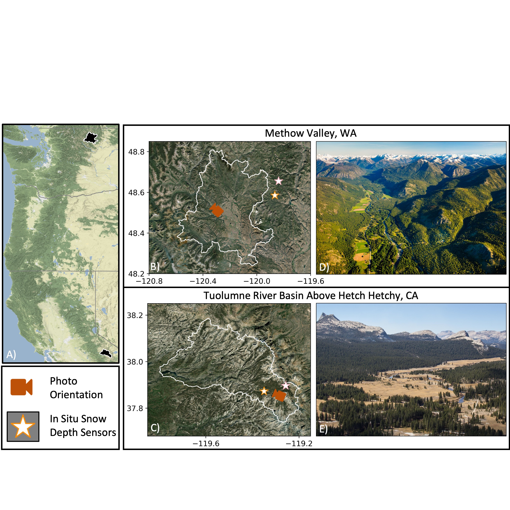

# Mountain snow depth retrievals from customized processing of ICESat-2 satellite laser altimetry
Investigating ICESat-2 SlideRule products for snow depth measurements in the Western U.S.

This repository contains code, data, and figures used for Besso, Shean, and Lundquist 2023. We calculate snow depth by differencing ICESat-2 ATL06 processed with Sliderule Earth from airborne lidar at two study sites. We calculate error metrics by comparing the ICESat-2 snow depths to various other snow depth measurements, such as SNOTEL and CDEC site data and Airborne Snow Observatory, Inc airborne snow on lidar flights.  

 

### Here I use SlideRule for ICESat-2 data access. SlideRule parameters:
* nsidc-s3
* release = 004
* length = 40
* step = 20
* confidence = 4 (only high confidence photons will be included)
* land class: atl08_ground
* spread = 20
* pe count = 10
* window = 3
* sigma = 5
* projection: global

