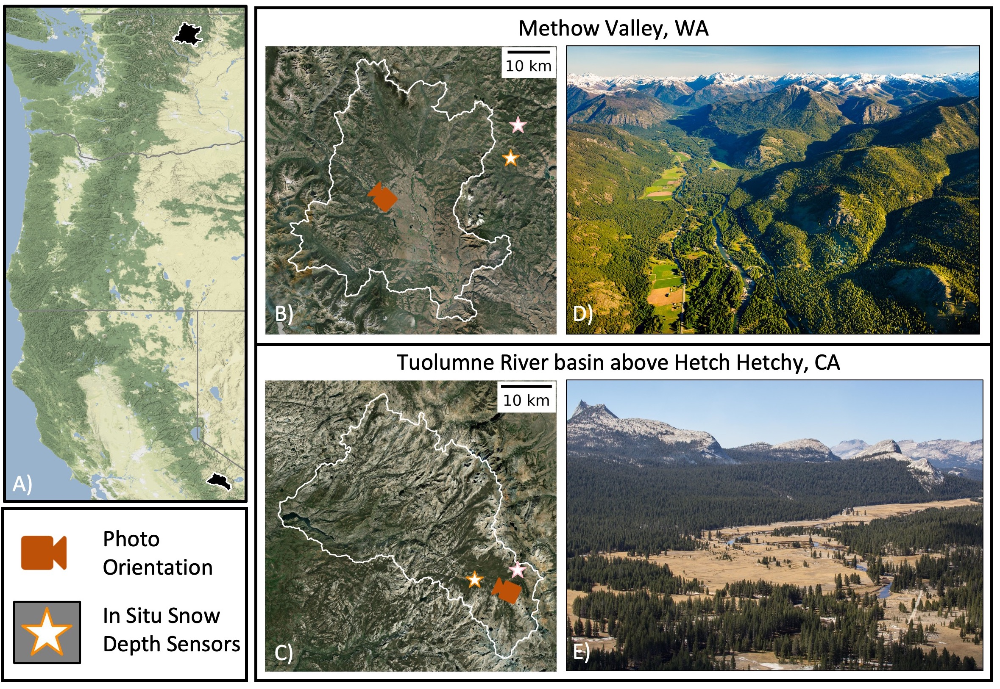

# Mountain snow depth retrievals from customized processing of ICESat-2 satellite laser altimetry
Investigating ICESat-2 SlideRule products for snow depth measurements in the Western U.S.
Besso, H., Shean, D., Lundquist, J., 2023. Mountain snow depth retrievals from customized processing of ICESat-2 satellite laser altimetry. Remote Sensing of Evironment, in review.

This repository contains code, data, and figures used for Besso, Shean, and Lundquist 2023. We calculate snow depth by differencing ICESat-2 ATL06 processed with Sliderule Earth from airborne lidar at two study sites. We calculate error metrics by comparing the ICESat-2 snow depths to various other snow depth measurements, such as SNOTEL and CDEC site data and Airborne Snow Observatory, Inc airborne snow on lidar flights.  

 

### Notebook execution steps:  
#### Methow Valley:
* download_dems
* create_lidar_polygon.ipynb
* Canopy_Metrics.ipynb
* Data_Acess_SR-ATL06.ipynb
* AUX_dataclean_methow.ipynb
* ATL06SR_dataclean_methow7912.ipynb
* ATL06SR_sample_raster_methow7912.ipynb

#### Tuolumne Basin:
* Data_Acess_SR-ATL06.ipynb
* snowdepth_metrics.ipynb
* AUX_dataclean.ipynb
* ATL06SR_dataclean.ipynb
* ATL06SR_sample_raster.ipynb
* compare_to_cdec.ipynb
* pair_comparison.ipynb

### Here I use SlideRule for ICESat-2 data access. SlideRule parameters:
* nsidc-s3
* release = 004
* length = 40
* step = 20
* confidence = 4 (only high confidence photons will be included)
* land class: atl08_ground
* spread = 20
* pe count = 10
* window = 3
* sigma = 5
* projection: global

